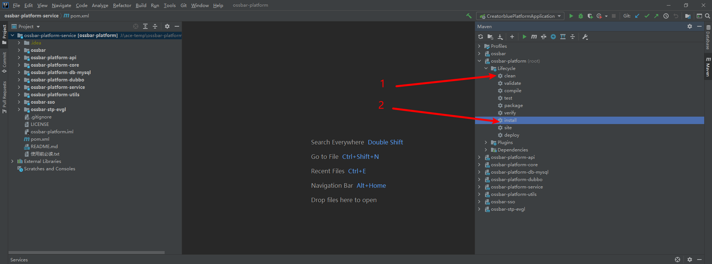
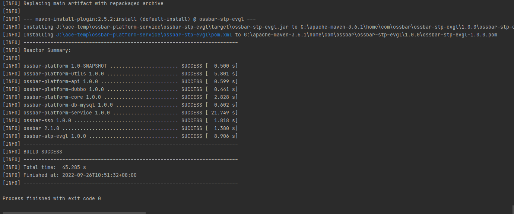
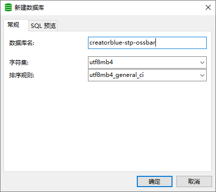
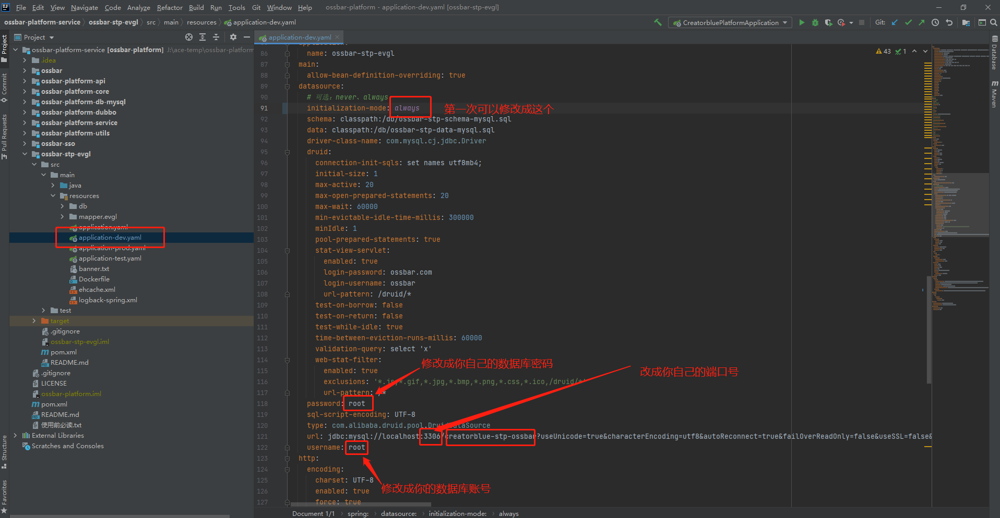
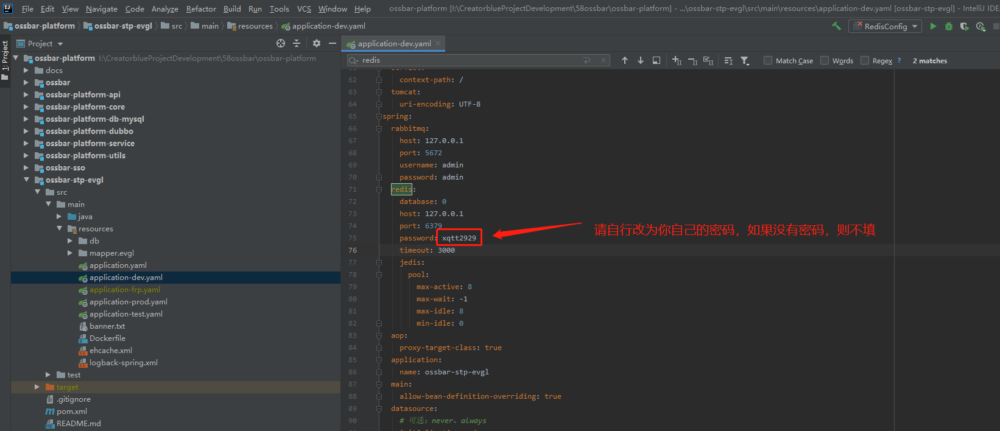
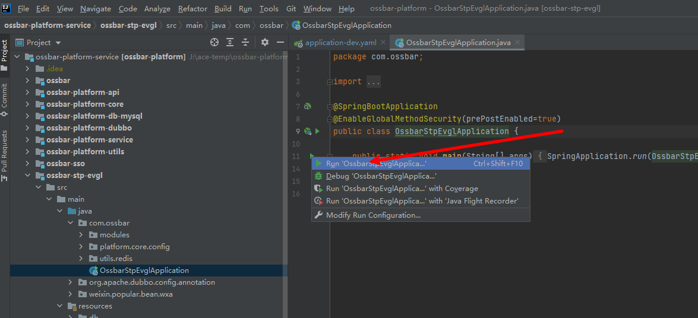
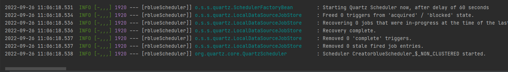

# 前提提要

请自行安装搭建好相关软件环境

环境准备：

- eclipse/idea
- jdk >= 1.8
- maven >= 3.5
- mysql >= 8.0
- redis >= 3

# 一、下载项目

下载好ossbar-paltform项目。使用git克隆下载、或zip下载压缩包，自己按需选择即可！

**github仓库**

克隆下载：https://github.com/58ossbar/ossbar-platform-service.git

zip下载：   https://github.com/58ossbar/ossbar-platform-service/archive/refs/heads/main.zip

**gitee仓库**

克隆下载：https://gitee.com/ossbar/ossbar-platform-service/repository/archive/main.zip

zip下载：https://gitee.com/ossbar/ossbar-platform-service.git

# 二、导入项目

使用eclipse或idea自行导入项目即可，若不会，查阅下资料即可

导入之后，耐心等待maven下载依赖，如果maven依赖下载过慢，国内用户建议修改为阿里云镜像等

导入成功

# 三、安装项目

之后分别执行

出现类似如下图片的情况，视为安装成功

# 四、建数据库

先创建数据库creatorblue=stp-ossbar

# 五、启动项目

## 修改数据库配置

找到ossbar-stp-evgl/src/main/java/resources/application-dev.yaml文件，修改一些信息，如下图所示

注意，一般只在你第一次启动程序时将spring.datasource.initialization-mode的值改为always

程序将自动建表生成数据，如果你已经自己手动执行了sql脚本，可以不改这个值，依旧保留为never

## 修改redis配置

## 启动程序

找到ossbar-stp-evgl/src/main/java/com/ossbar/OssbarStpEvglApplication启动类。

运行该类的main方法即可

控制台中出现如下信息，视为启动成功。

（注意：如果你是修改了spring.datasource.initialization-mode为always 那么会比较慢，因为在建表和导数据，耐心等待即可）

**浏览器访问**

http://localhost:19999/index-api/

http://localhost:19999/wx/index-api/showAvd/

# 可能遇到的错误

org.springframework.amqp.AmqpConnectException: java.net.ConnectException: Connection refused: connect

这是没有rabbitmq环境引起的，不安装也不影响使用！